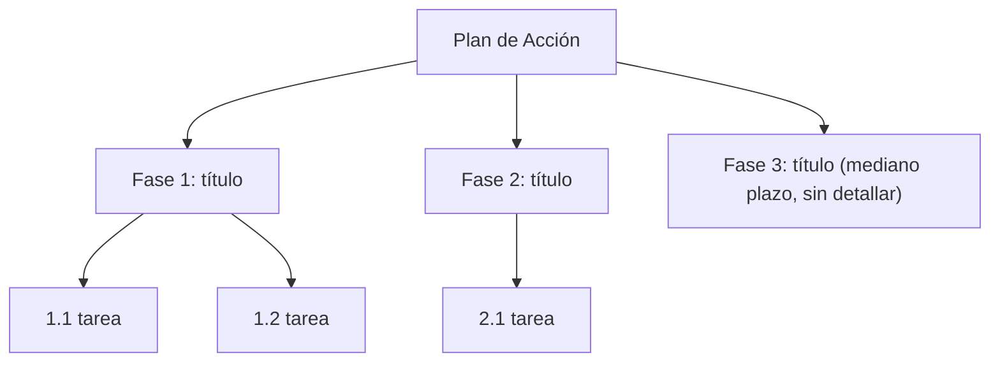

# Propose Action Plan

## Objetivo
Tomar un roadmap ya aprobado (fases + tareas + criterios de aceptación) y decidir, junto al
usuario, qué parte se ataca ya (documentada completa y ejecutable) y qué parte queda como
visión de mediano plazo (mencionada, no desarrollada). El resultado final incluye un WBS
visual (ASCII + Mermaid) de todo el plan.

## Cuándo NO usar
- No existe un roadmap todavía → correr primero la skill `propose-roadmap`, no inventar fases desde cero acá.
- El usuario ya dijo explícitamente qué fases quiere y en qué orden → saltar el paso de negociación de fases y confirmar una sola vez, no interrogar de más.

## Pasos obligatorios

### 1. Ubicar el roadmap fuente
Buscar el roadmap ya generado en el repo (ej. `specs/ROADMAP.md`, `ROADMAP.md`, o el nombre
que el proyecto use). Si hay más de un candidato, o el roadmap es viejo y puede estar
desalineado con el estado real del código, decirlo antes de seguir — no asumir en silencio
cuál es la fuente de verdad.

Si no se encuentra ningún roadmap, parar y decirle al usuario que corra `propose-roadmap`
primero (o generarlo si el usuario lo pide explícitamente en el momento).

### 2. Extraer solo las fases (sin tareas todavía)
Del roadmap, sacar la lista de fases en su orden de dependencia, cada una con su título y
una línea de intención — nada de tareas ni AC en este paso. Esto es a propósito: la
negociación de alcance tiene que pasar sobre fases, no sobre el detalle.

### 3. Negociar alcance con el usuario (usar AskUserQuestion)
Presentar las fases enumeradas en orden y preguntar explícitamente:
- ¿Cuáles fases entran en el plan de acción **inmediato** (se documentan completas ahora)?
- ¿Cuáles quedan como **mediano plazo** (se mencionan, no se desarrollan todavía)?
- Si el orden de dependencia del roadmap sugiere que una fase "inmediata" necesita una
  "mediano plazo" no elegida como prerequisito, señalar el conflicto y volver a preguntar —
  no elegir por el usuario.

No avanzar al paso 4 sin una confirmación clara del corte inmediato/mediano plazo. Si el
usuario responde ambiguo, repreguntar con las opciones concretas restantes, no asumir.

### 4. Redactar el documento — fases inmediatas (detalle completo)
Por cada fase marcada como inmediata:

```
## Fase N — <Título>

### N.1 <Tarea>
- AC1 [<importancia>]: <criterio corto, reproducible, testeable>
- AC2 [<importancia>]: ...
```

Niveles de importancia por AC (elegir uno, no inventar escala propia):
- **Crítico** — si falla, bloquea el objetivo de la fase o el negocio. Todo AC crítico
  necesita una historia de usuario asociada, formato `Como <rol>, quiero <acción>, para
  <beneficio>`, escrita justo debajo del AC.
- **Importante** — afecta calidad o experiencia pero no bloquea.
- **Deseable** — mejora, no imprescindible para cerrar la fase.

Reusar el mismo estándar de criterios de aceptación que `propose-roadmap` (corto,
reproducible, testeable) — esta skill no reduce ese estándar, solo agrega importancia +
historias de usuario donde corresponda.

### 5. Redactar el documento — fases de mediano plazo (noción liviana)
Por cada fase marcada como mediano plazo: solo título + 1-2 líneas de intención/alcance
esperado. Explícitamente marcar como "no desarrollada todavía" — no inventar tareas ni AC
para no crear falsa sensación de que ya está planificado al detalle.

### 6. WBS — versión ASCII
Árbol de texto plano con todas las fases (inmediatas con sus tareas, mediano plazo como
hoja única sin hijos), ejemplo de forma:
```
H21 — Plan de Acción
├── Fase 1 — <título> [inmediato]
│   ├── 1.1 <tarea>
│   └── 1.2 <tarea>
├── Fase 2 — <título> [inmediato]
│   └── 2.1 <tarea>
└── Fase 3 — <título> [mediano plazo, sin detallar]
```

### 7. WBS — versión Mermaid
Mismo árbol en sintaxis Mermaid (`flowchart TD`), un nodo por fase y sus tareas como hijos;
fases de mediano plazo como nodo hoja sin expandir, con etiqueta que lo indique. Ejemplo:

Verificar que el bloque mermaid resultante sea válido (nombres de nodo sin caracteres que
rompan sintaxis, comillas en labels con paréntesis o dos puntos).

### 8. Guardar el documento
Ubicación por defecto: junto al roadmap fuente (ej. `specs/PLAN-INMEDIATO.md` o
`specs/ACTION-PLAN.md`) — si el repo ya tiene convención de nombres de plan, seguirla. No
duplicar ni pisar el roadmap original: este documento es un recorte + detalle, el roadmap
sigue siendo la fuente de fases completas.

## Resultado esperado
Un documento con fases inmediatas totalmente accionables (tareas, AC con importancia,
historias de usuario en lo crítico) y fases de mediano plazo apenas esbozadas, cerrado con
un WBS en ASCII y otro en Mermaid que reflejan la misma estructura de fases/tareas.
