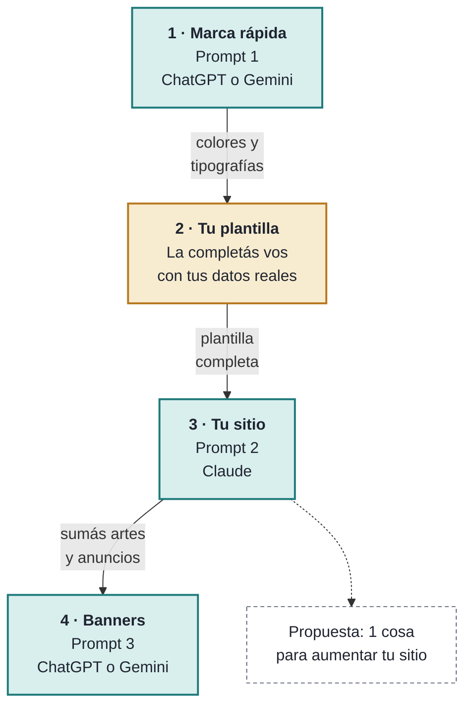

# Bonus · Trabajar con IA

> **Esto no es una clase del curso.** Es un recurso aparte (otro curso, un bonus) para usar cuando quieras, entre medio de las clases. No dura nada ni se evalúa. Usa lo que ya aprendiste: la IA te da un primer borrador rápido y **vos revisás, entendés y decidís**.

## El recorrido: 4 pasos, en este orden



<small>🟩 **Verde:** lo hace la IA con tu revisión. 🟨 **Amarillo:** lo hacés vos.</small>

1. **Prompt 1** te propone una marca y te da colores y tipografías recomendadas.
2. Esos datos y los tuyos van a la [plantilla de tu sitio](plantilla-sitio.md).
3. **Prompt 2** convierte tu plantilla en el sitio y te propone **1 cosa para sumar**.
4. **Prompt 3** crea banners o artes para tus anuncios.

## Qué IA usar (en una línea cada una)

| IA | La usamos para… |
|---|---|
| **Claude** | Estructura y **código** (Prompt 2) |
| **ChatGPT** | Textos, ideas creativas e **imágenes** (Prompts 1 y 3) |
| **Gemini** | Lo mismo que los otros dos en tareas chicas (suele gastar menos cupo) y **búsquedas** |

Si una se queda sin cupo, probá con otra: los prompts sirven en las tres. Para elegir según el tipo de trabajo, mirá la [cheatsheet](cheatsheet.md).

## Tres reglas

1. **La IA propone, vos decidís.** Leé todo. Si no entendés algo, preguntale: "explicame esta parte".
2. **No inventes.** Nada de testimonios, premios, precios o datos falsos. Donde falte un dato, que quede `[COMPLETAR]`.
3. **Probá antes de usar.** Abrí el sitio en el navegador y también en modo celular (`F12`). No pegues datos personales que no quieras hacer públicos.

---

## Prompt 1 · Marca rápida (va primero)

**Para qué:** en pocos minutos tenés nombre e ideas de eslogan, personalidad, colores y tipografías. Lo que salga lo copiás a la sección 2 de tu [plantilla](plantilla-sitio.md).
**IA sugerida:** ChatGPT o Gemini. Completá los `[corchetes]` y pegá.

```
Soy estudiante y quiero armar una marca rápida para mi sitio web.

Mis datos:
- Tipo de proyecto: [marca personal / emprendimiento / portfolio]
- Nombre (o "no tengo, proponé 3"): [nombre]
- Qué hago o qué ofrezco: [una o dos frases]
- Para quién es: [mi público]
- 3 palabras que describen cómo quiero que me vean: [ej. cercana, creativa, confiable]
- Colores o estilos que NO quiero: [opcional]

Devolveme SOLO esto, corto y ordenado:
1. Nombre: el mío, o 3 opciones si no tengo.
2. Eslogan: 3 opciones de máximo 8 palabras.
3. Personalidad: 3 palabras y el tono de voz en una frase.
4. Logo: una descripción de 2 líneas de un logo simple para mi marca (sin texto complicado).
5. Paleta de 3 colores con código hexadecimal y su rol: color principal (títulos y botones), color de texto (oscuro) y color de fondo (claro).
   El texto debe leerse bien sobre el fondo (contraste alto). Explicá en una línea por qué elegiste cada color.
6. Tipografías: 2 en total, una para títulos y otra para el texto. Que sean de Google Fonts, y dame para cada una la línea de CSS
   con una tipografía de respaldo (por ejemplo: font-family: "Poppins", Arial, sans-serif;).

Cerrá con un bloque llamado "PARA MI PLANTILLA" con solo: personalidad, eslogan elegido, colores (principal, texto, fondo) y tipografías (títulos, texto).
No inventes datos sobre mí.
```

> **Verificá el contraste:** las IAs se equivocan calculándolo. Probá tu color de texto y de fondo en el [verificador de contraste de WebAIM](https://webaim.org/resources/contrastchecker/) y buscá que diga "Pass".

---

## Prompt 2 · Tu sitio, desde la plantilla

**Para qué:** convierte tu [plantilla completada](plantilla-sitio.md) en un sitio de una sola página (`index.html` + `style.css`) y te propone **1 cosa para aumentar** lo hecho.
**IA sugerida:** Claude (estructura y código). Pegá tu plantilla completa donde dice `[PEGAR PLANTILLA]`, o adjuntá el archivo `.md`.

```
Sos un profesor de HTML y CSS para estudiantes de colegio. Con la plantilla que te pego abajo, generá mi sitio web de una sola página.

REGLAS:
- Solo HTML y CSS. Sin JavaScript, sin frameworks y sin librerías externas (salvo la tipografía de Google Fonts si mi plantilla la pide).
- Dos archivos separados: index.html y style.css. El CSS se vincula con <link rel="stylesheet" href="style.css"> dentro del <head>.
- En el <head> poné: meta charset, <meta name="viewport" content="width=device-width, initial-scale=1">, un <title> con mi nombre y el <link> al CSS.
- Una <section> con id por cada sección de mi plantilla. Un solo <h1>; los títulos de sección son <h2>.
- Usá EXACTAMENTE los colores y tipografías de mi plantilla: definí fondo, color de texto y fuente en body, y usá el color principal en títulos y botones.
- Usá SOLO los textos y datos de mi plantilla. No inventes testimonios, precios, premios ni cifras. Donde falte un dato, escribí [COMPLETAR].
- Imágenes: usá los nombres de archivo de mi plantilla dentro de una carpeta img/ (por ejemplo img/banner.jpg), con un alt descriptivo. No inventes links.
- Contacto: botón de WhatsApp con https://wa.me/NÚMERO, correo con mailto: y redes con target="_blank" rel="noopener noreferrer", según mis datos.
- Responsive: imágenes con width: 100% y max-width; una media query (max-width: 600px) al final del CSS.
- Comentá el código para que un principiante entienda cada bloque.

DEVOLVÉ, EN ESTE ORDEN:
1. El archivo index.html completo, en un bloque de código.
2. El archivo style.css completo, en otro bloque de código.
3. Una lista corta de las imágenes que tengo que poner en la carpeta img/ y qué debe mostrar cada una.
4. UNA propuesta para aumentar mi sitio (una sola): qué agregar o mejorar, por qué le sirve a mi público y cómo se haría con HTML y CSS. NO la implementes: solo proponela, en 4 líneas como máximo.
5. Los pasos para probarlo: crear una carpeta, guardar los dos archivos adentro, abrir index.html en el navegador y revisarlo en modo celular.

MI PLANTILLA:
[PEGAR PLANTILLA]
```

**Después:**
- Guardá `index.html` y `style.css` **en la misma carpeta** (con la carpeta `img/` al lado) y abrí `index.html`.
- Si te gusta la propuesta, pedile: *"Implementá la propuesta que hiciste, cambiando solo lo necesario y marcando con comentarios qué cambió"*.
- Si algo no funciona: *"Pasa esto: [describí lo que ves]. Este es mi código: [pegá]. ¿Qué revisarías primero?"*

---

## Prompt 3 · Banners para tus anuncios o artes

**Para qué:** imágenes para una promoción, un lanzamiento, un evento o una novedad: para tu sitio o tus redes.
**IA sugerida:** ChatGPT (imágenes) o Gemini. Completá los `[corchetes]`.

```
Creá una imagen de anuncio para mi [emprendimiento / marca / proyecto]: [nombre].

- Qué anuncio: [promoción / lanzamiento / evento / novedad] de [qué es].
- Formato: [banner horizontal ancho para web (proporción 3:1) / cuadrado para Instagram (1:1) / vertical para historias (9:16)].
- Estilo: [minimalista / flat design / colorido / elegante / divertido].
- Colores (los de mi marca): fondo [#xxxxxx], principal [#xxxxxx], detalles [#xxxxxx].
- Elemento central: [una taza, una cámara, mis productos, un ícono, una persona ilustrada…].
- Sensación que quiero transmitir: [las 3 palabras de mi marca].
- Texto en la imagen: [SIN TEXTO]  (o, si lo necesito: EXACTAMENTE estas palabras, sin cambiar ni una letra: "[máximo 4 palabras]").
- Dejá un espacio libre de [un lado / abajo] para poder agregar texto después.
```

**Consejos:**
- **Mejor sin texto.** Las IAs suelen deformar las letras: pedí la imagen sin texto y escribilo después con Canva o con HTML y CSS. Si lo pedís dentro de la imagen, que sean pocas palabras y **revisá cada letra**.
- **Cambiá una cosa por vez.** Si no te gusta: *"Mantené la imagen pero cambiá solo [el fondo / el color / el estilo]"*.
- **Guardala liviana.** Comprimila (por ejemplo en [Squoosh](https://squoosh.app/)) y ponela en tu carpeta `img/`.
- **Usala en tu sitio:**

```

```

```
.banner { width: 100%; max-width: 1200px; }
```
